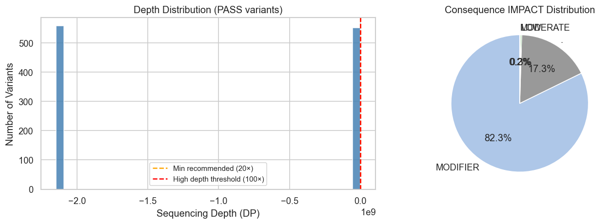
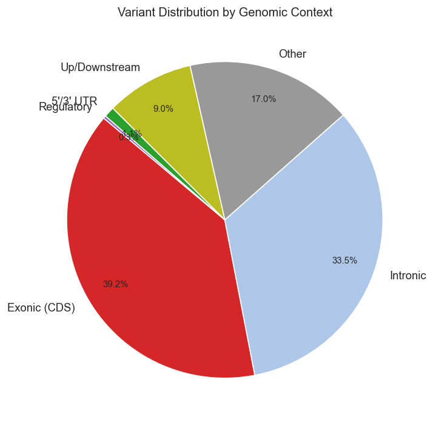
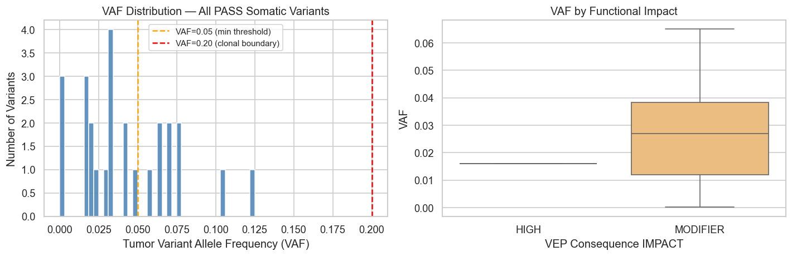
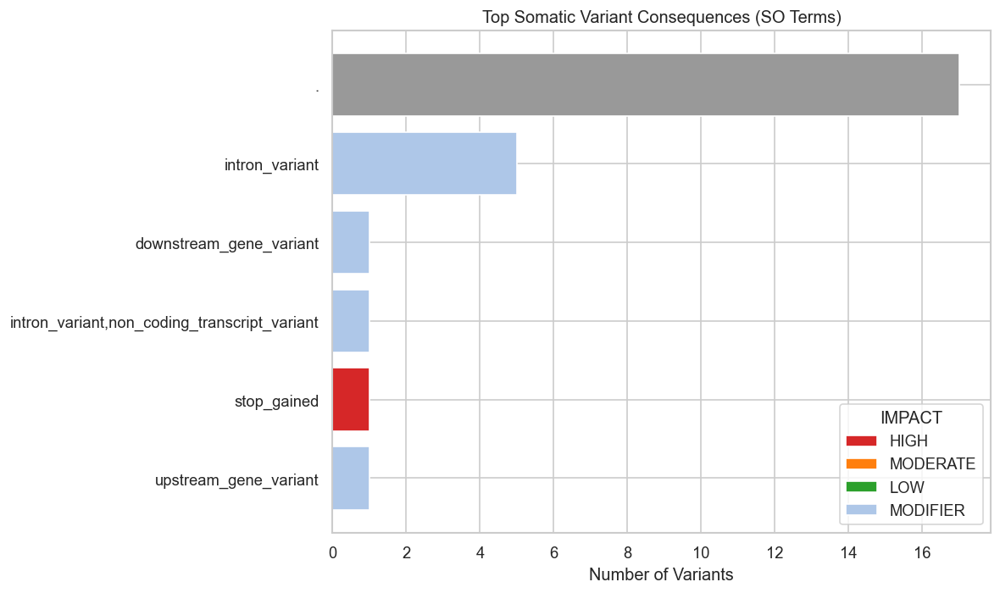
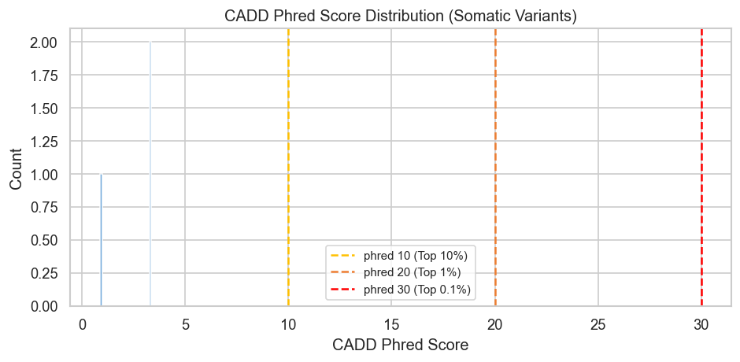
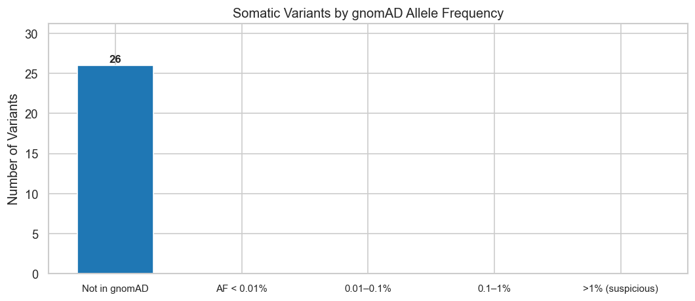

# Demo — Pipeline Outputs

A visual walkthrough of what this workshop produces. All figures are generated by running the pipeline on publicly available GATK tutorial data (~100 MB download).

---

## Germline Pipeline (chr20, CEPH Trio NA12878/NA12891/NA12892)

### Sequencing Depth & Functional Impact
1,111 PASS variants called across chr20. Left: sequencing depth distribution with recommended thresholds. Right: consequence impact breakdown — the majority are MODIFIER (intronic/UTR), with 2 MODERATE and 0 HIGH impact variants in this 65 Mb region.



### Genomic Context Distribution
Variant distribution across functional elements. Exonic (CDS) and Intronic variants dominate as expected for WGS. The small exonic fraction (435/1111) is where clinical prioritisation focuses.



---

## Somatic Pipeline (chr17:7M–20M, HCC1143 Breast Cancer Cell Line)

### Tumor Variant Allele Frequency (VAF)
Left: all 26 PASS variants cluster at very low VAF (median 0.034), consistent with subclonal or low-purity signal. Right: VAF stratified by VEP impact — the single HIGH impact variant (NT5C3B stop-gained) sits at VAF=0.016.



### Consequence Type Breakdown
Variant consequences colored by IMPACT tier. `downstream_gene_variant` and `upstream_gene_variant` dominate (MODIFIER), with one HIGH impact stop-gained in NT5C3B and a handful of MODIFIER intron/non-coding variants in annotated genes (NF1, MAP2K4, MYH1).



### CADD Deleteriousness Scores
CADD phred scores for SNVs. Thresholds: phred ≥ 20 = top 1% most deleterious genome-wide.



### gnomAD Population Allele Frequencies
26/26 variants are absent from gnomAD — expected for somatic mutations in a cancer cell line. Variants with gnomAD AF > 1% would flag as likely germline polymorphisms missed by tumor-normal subtraction.



---

## Agentic Interpretation Layer (Claude API)

The `agent/variant_interpreter.py` script sends each prioritised variant to Claude with a structured prompt encoding consequence, CADD score, gnomAD AF, ClinVar significance, and VAF/zygosity. It returns:

- **ACMG tier** for germline (PATHOGENIC / LIKELY_PATHOGENIC / VUS / LIKELY_BENIGN / BENIGN)
- **AMP/ASCO/CAP tier** for somatic (TIER_I / TIER_II / VUS_SOMATIC / PASSENGER / UNCLASSIFIED)
- Natural language interpretation citing specific evidence

**Example somatic output (NT5C3B stop-gained, VUS_SOMATIC):**
```
VARIANT: NT5C3B p.*  |  TIER: VUS_SOMATIC  |  VAF: 0.016
──────────────────────────────────────────────────────────
This stop-gained variant in NT5C3B introduces a premature termination codon,
predicted to trigger nonsense-mediated decay or produce a truncated protein.
NT5C3B (5'-nucleotidase, cytosolic IIIB) is not a well-established cancer
driver gene, and no CIViC or ClinVar evidence links this variant to cancer
phenotypes. The low VAF (0.016) is consistent with a subclonal or low-purity
event. Classified as VUS_SOMATIC pending functional data or recurrence in
cancer databases.
```

**Germline — 50 variants interpreted (claude-haiku-4-5), cost ~$0.01**  
**Somatic — 26 variants interpreted (claude-haiku-4-5), cost ~$0.005**

---

## Notebooks

Interactive exploration available at:
- Germline: [`germline/notebooks/germline_results.ipynb`](germline/notebooks/germline_results.ipynb) — [view on nbviewer](https://nbviewer.org/github/zhuy16/variant-calling-workshop/blob/main/germline/notebooks/germline_results.ipynb)
- Somatic: [`somatic/notebooks/somatic_results.ipynb`](somatic/notebooks/somatic_results.ipynb) — [view on nbviewer](https://nbviewer.org/github/zhuy16/variant-calling-workshop/blob/main/somatic/notebooks/somatic_results.ipynb)
